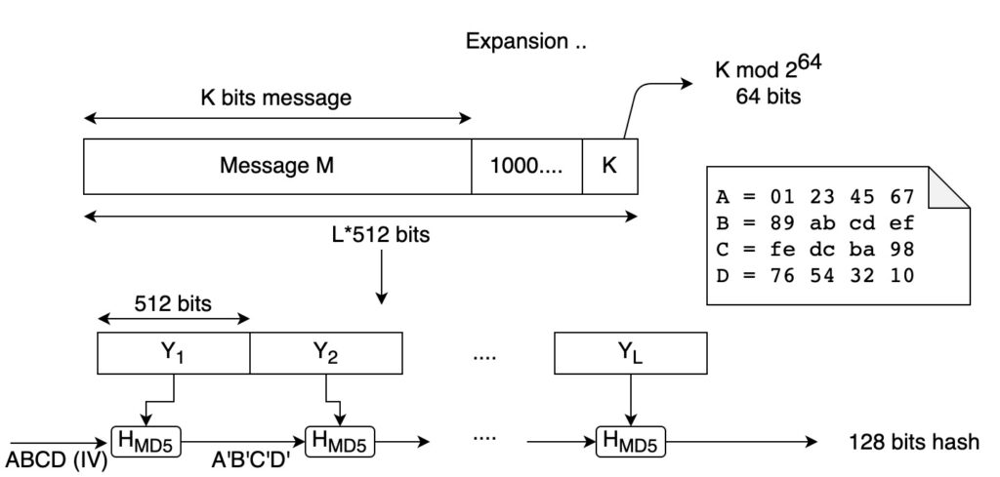
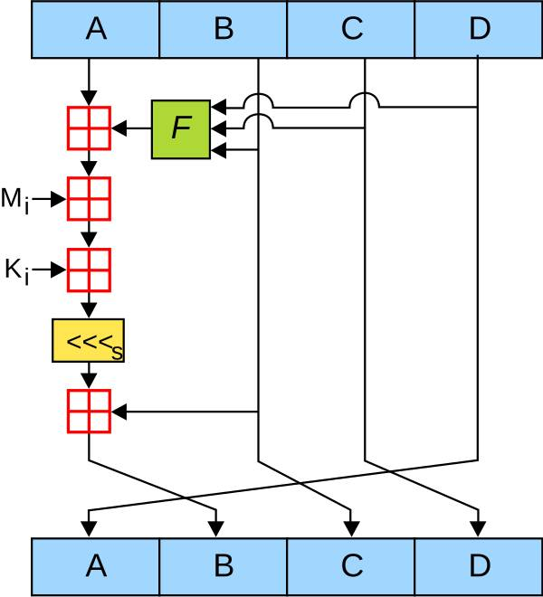
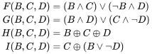
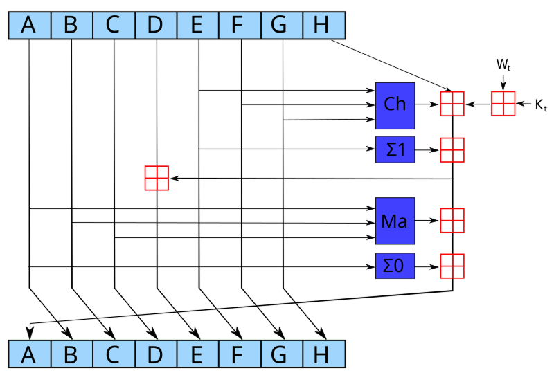
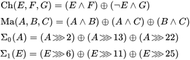

# 42-ssl_md5

This is a project from 42 School that aims to reimplement the md5 and sha256 hashing function.
The goal is to understand the internal workings of cryptographic hash functions and implement them from scratch in C.

## Usage

To compile the project, run the following command:

```bash
make
```

To hash a string using the md5 algorithm, run the following command:

```bash
./ft_ssl md5 -s "string"
``` 

To hash a file using the sh256 algorithm, run the following command:

```bash
./ft_ssl sh256 file.txt
```

## Options

The following options are available:

```
Usage: ./ft_ssl [command] [options] [files]
Options:
  -p, --print           Echo STDIN to STDOUT and append the checksum to STDOUT
  -q, --quiet           Quiet mode
  -r, --reverse         Reverse the output format
  -s, --string          Hash the string
  -?, --help            Display this help

Commands:
  md5                   Compute the MD5 hash
  sha256                Compute the SHA256 hash
```

## Implementation

### Padding

The input message is padded to block size of 512 bits (64 bytes) minus 64 bits (8 bytes) for the length of the message. The padding is done as follows:

1. Append a single bit "1" to the message.
2. Append "0" bits until the length of the message is 64 bits less than a multiple of 512.
3. Append the length of the message as a 64-bit integer.



### MD5 (Message-Digest Algorithm)

The md5 algorithm consists of four rounds of 16 operations each. Each operation is a non-linear function of the message block, the previous hash value, and a constant value. The result of each operation is added to the previous hash value to produce the new hash value.

- [MD5 explained in video](https://www.youtube.com/watch?v=5MiMK45gkTY)
- [RFC 1321](doc/rfc1321_md5.pdf)





### SHA256 (Secure Hash Algorithm)

The sha256 algorithm is similar to md5 but uses a different set of constants and functions. The message block is divided into 16 32-bit words, which are then expanded into 64 32-bit words using a non-linear function. The expanded message block is then processed in 64 rounds of operations to produce the final hash value.

- [RFC 6234](doc/rfc6234_sha.pdf)




